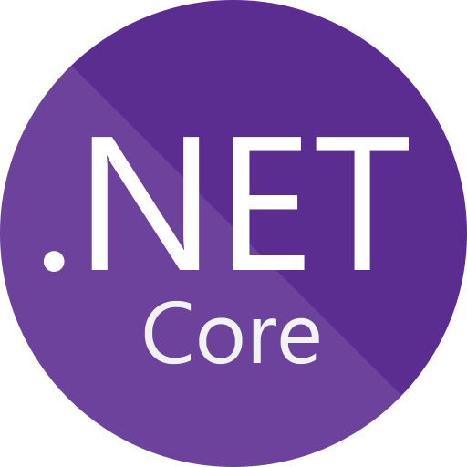
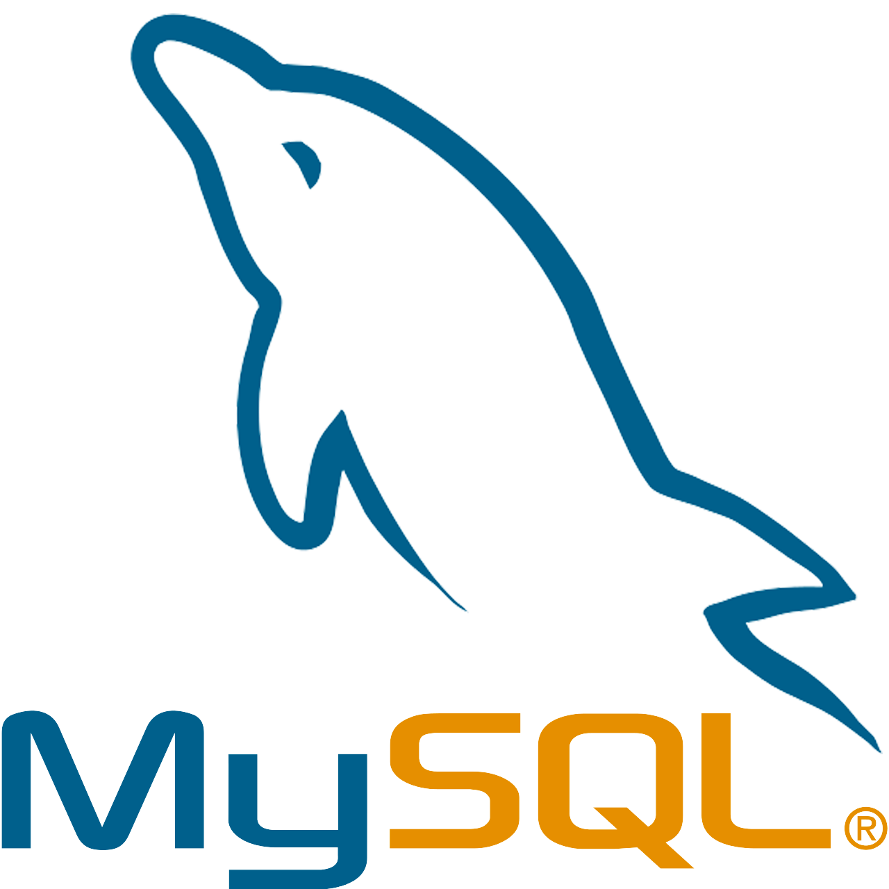
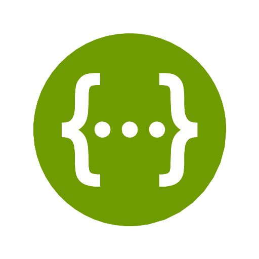
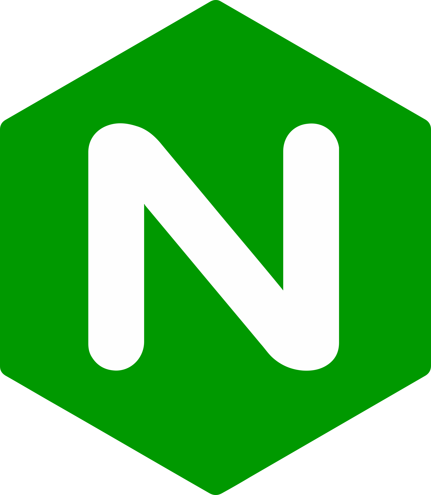

<h1>Quizzler-Backend</h1>

<h2>Overview</h2>

Quizzler is a dynamic application designed to help students study in a way that suits them best. Experience it now: <a href="https://quizzler.tech/">Try Quizzler</a>

<h3>Advanced Study Methods</h3>
<ul>
  <li><strong>Spaced Repetition</strong>: Utilizes the psychological spacing effect to help reinforce knowledge retention over increasing intervals.</li>
  <li><strong>Social Interaction</strong>: Engage with friends through lesson sharing and friendly competition, making your learning journey more engaging and enjoyable.</li>
</ul>

<h2>Technologies Used</h2>
<h3>Backend</h3>

  &emsp;&emsp;&emsp;
  &emsp;&emsp;&emsp;
  &emsp;&emsp;&emsp;
  &emsp;&emsp;&emsp;

<ul>
  <li>ASP.NET Core: A high-performance framework for building modern, cloud-based, and internet-connected applications.</li>
  <li>Entity Framework Core: A lightweight, extensible, open-source, and cross-platform version of the popular Entity Framework data access technology.</li>
  <li>MySQL: A reliable and efficient open-source relational database management system.</li>
  <li>Swagger: An Interface Description Language for describing RESTful APIs expressed using JSON.</li>
</ul>

<h3>DevOps</h3>

  &emsp;&emsp;&emsp;
  &emsp;&emsp;&emsp;
  &emsp;&emsp;&emsp;
  &emsp;&emsp;&emsp;

<ul>
  <li>Fedora: A robust, secure, and open-source Linux distribution.</li>
  <li>Jenkins: An open-source automation server helping to reliably build, test, and deploy your code.</li>
  <li>Nginx: A high-performance HTTP server and reverse proxy.</li>
  <li>Docker: A platform that enables developers to create, deploy, and run applications in containers.</li>
</ul>

<h2>Database Schema</h2>

